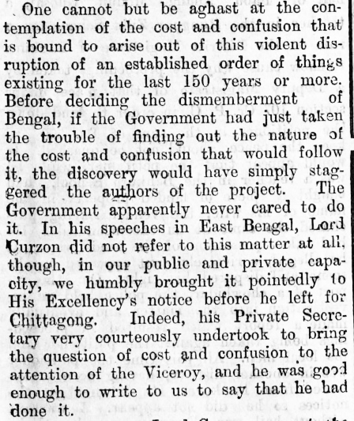

Our first attempt looks at how various magazines and periodicals covered the Partition of Bengal, which was announced on July 19, 1905, and came into effect on October 16th of that year.

First up, the _Amrita Bazaar Patrika_ which kept up steady opposition to the move. Here is an article from July 27, that discusses massive administrative costs and confusion the move would entail. 

The entire edition is [available for perusal](http://crossasia-repository.ub.uni-heidelberg.de/3298/1/19050727.pdf) at the University of Heidelburg repository, which contains the archive of the newspaper from 1870-1949. Interesting that the practice of covering the entire front-page ads isn't a marketing innovation brought in to revive dwindling print sales, as I'd imagined. The newspaper was digitised in a [herculean effort](https://www.livemint.com/Consumer/1BOhdx9LwQIEkWvsYX17sN/Challenge-of-digitizing-old-books-and-documents.html) by the [Centre for Studies in Social Sciences](https://www.cssscal.org), Calcutta.

Meanwhile, _The Bengalee_, founded in 1862,  